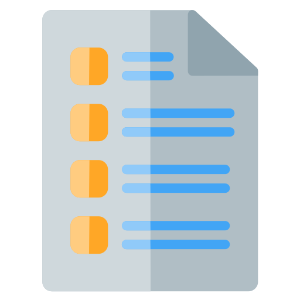

 
<h3 align="center">Feedback Form</h3>

A lightweight web applicatoin developed in the web framework Flask.

<h2></h2>

 

## Description
Feedback-Form is a full-featured web application created using the Flask framework in Python.  
After gathering user data Feedback-Form will email configured participants the data.

## Requirements
* Python 3.8.2+

## Contributions
Contributions are always welcome!  
Just make a [pull request](../../pulls).

## Licence
MIT licence
